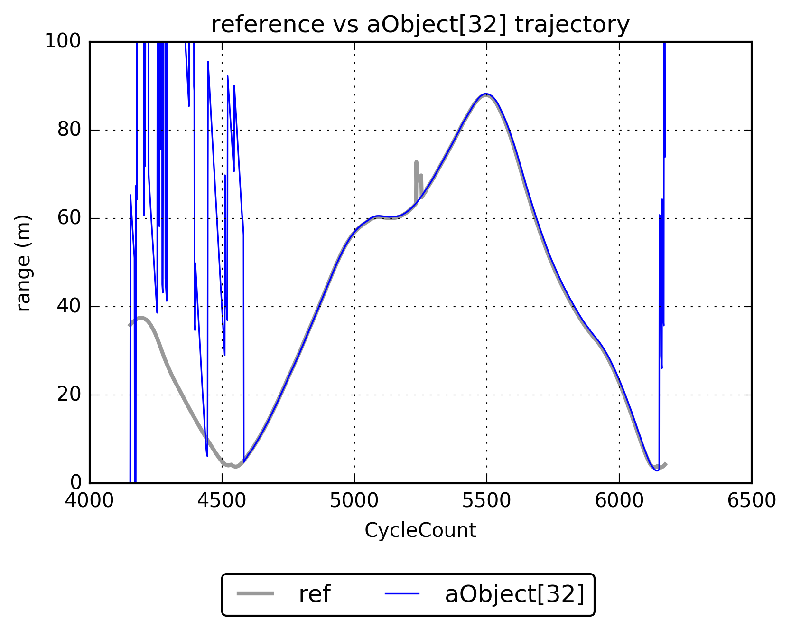
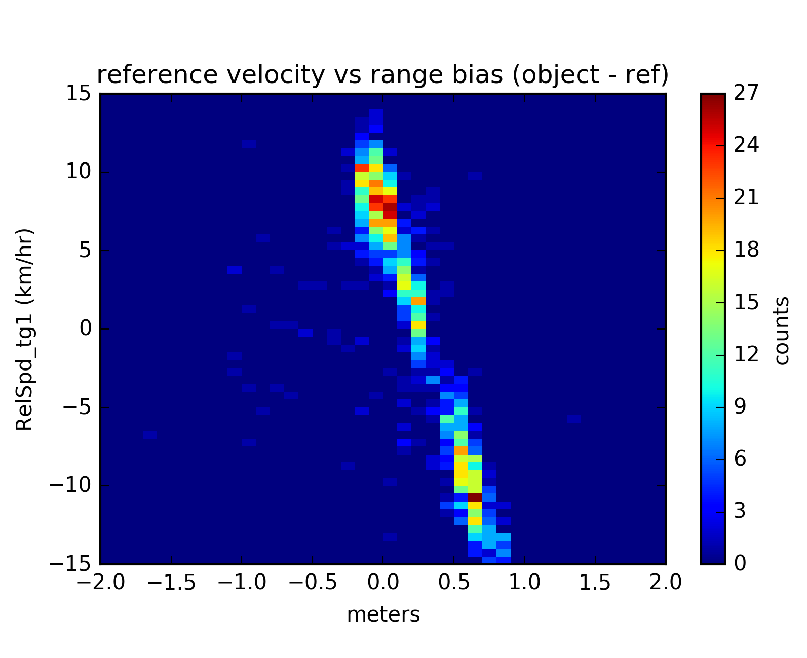
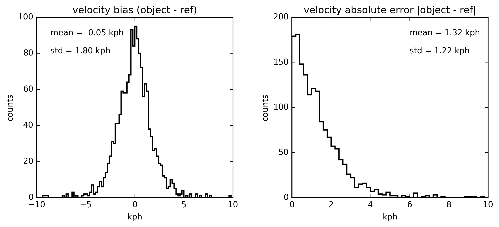

[](https://travis-ci.org/kirknorth/continental-sample)

### Description
---------------
This repo contains my work in basic I/O and processing of a sample of radar data. The first goal was to write a reader capable of handling the provided CSV file as well as any other file of similar nature but representing a different scenario. The second goal was to find the radar object in the sample data which most closely matched the reference and characterize its positional and velocity errors.

The original sample data contained range, velocity, and angular GPS measurements for 2000+ time steps.

<p align="center">
    
</p>

### Usage
---------
At a terminal, navigate to the directory that contains `proc_sample.py` and type

```bash
python proc_sample.py file [-h] [-v]
 ```
 
The `file` parameter should be the file name including path of the CSV file. Arguments in brackets are optional.
 
### Dependencies
----------------
The only dependency of `proc_sample` is [NumPy](http://www.numpy.org/).
 
### Results
-----------
It turns out that the longest tracked radar object `aObject[32]` best matches the reference. Here's the output of running `proc_sample` on the sample file provided in verbose mode:

```bash
> python proc_sample.py Scenario_crossing_left_to_right_50mph.csv -v
> Number of headers: 287
> Number of radar objects: 40
> Number of time steps: 2021
> Longest tracked radar object: aObject[32]
```

#### Positional errors
The context of this discussion assumes that both the GPS used to track the reference and the radar object identification have sub-meter, even sub-centimeter location precision. For someone like myself coming from a meteorological remote sensing background this sounds more like a fantasy, so I'm interested in learning more about this.

Below is a plot of the reference trajectory versus that of `aObject[32]`. It is clear not all trajectory data of `aObject[32]` is valid, and these time steps are ignored in my analysis.

<p align="center">
    
</p>
  
The distributions of the trajectory differences and absolute differences between `aObject[32]` and the reference are both bimodal, indicating trajectory errors are dependent on at least one independent variable. The figure below was created by computing these difference fields and counting occurrences in 10 cm bins. Due to the bimodality, the mean and standard deviations reported in the plot should be ignored since they characterize the whole; rather a mean and standard deviation should be computed for each separate distribution.

<p align="center">
    
</p>

I originally speculated the bimodality was the result of beam broadening offsetting the position, e.g., smaller resolution volume closer to host vehicle (peak around 0 cm), larger resolution volume further from host vehicle (peak around 60 cm). However, upon further inspection, it appears the bimodality is due to directional miscalibration or offset, where the range of objects approaching the host vehicle are systematically overestimated by the radar, on average by approx. 60 cm. This can be seen in the two-dimensional density plot between range differences and reference velocity. Range data is binned every 10 cm and velocity data is binned every 0.5 kph. The two distributions are clearly separated in this plot, one distribution for objects moving towards the host vehicle and one distribution for objects moving away from the host vehicle.

<p align="center">
    
</p>

#### Velocity errors
The convention for this data set has the typical Cartesian (x, y) coordinates rotated 90 deg counterclockwise, so positive x is northward and positive y is westward. Objects moving towards the host vehicle should exhibit negative velocity, and objects moving away from the vehicle should exhibit positive velocity. With this in mind, I computed each radar object's radial velocity using the following two equations.

<p align="center">
    
</p>

Below is a plot of the reference velocity versus that of `aObject[32]`. It is interesting to note the relative noisiness in the GPS velocity data, e.g., compared to the GPS range data. I'm interested in learning more about this and the reasons behind it.

<p align="center">
    
</p>

The distributions of the velocity differences and absolute differences between `aObject[32]` and the reference are shown in the figure below. The velocity difference distribution is Gaussian with a mean of -0.05 kph and standard deviation of 1.80 kph. Assuming a 1/100th kph is approaching sensor precision, there appears to be no significant systematic bias in radar object velocity. The mean absolute velocity difference between `aObject[32]` and the reference is 1.32 kph (mean of distribution in second panel below), which gives us a *best case scenario* for the radar velocity error since it weights all differences the same. Instead, a more useful metric is the root-mean-squared difference since larger differences have more impact, thus providing a *worst case scenario* for the radar velocity error. For `aObject[32]`, the root-mean-squared velocity difference is 1.80 kph. It's interesting to note that this radar velocity error of 1.80 kph or 0.5 m s<sup>-1</sup> is similar to the velocity errors of modern weather radars in low SNR.  

<p align="center">
    
</p>