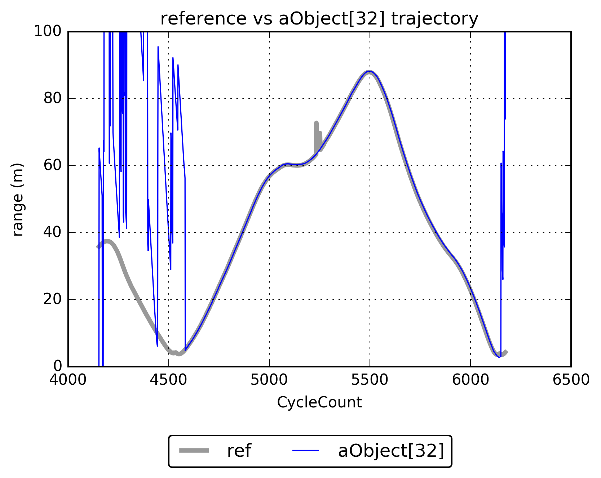
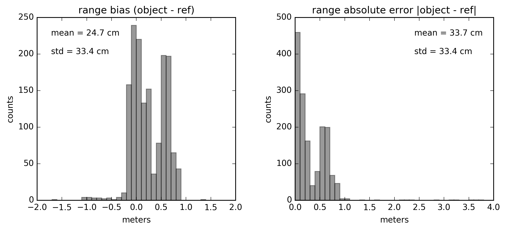
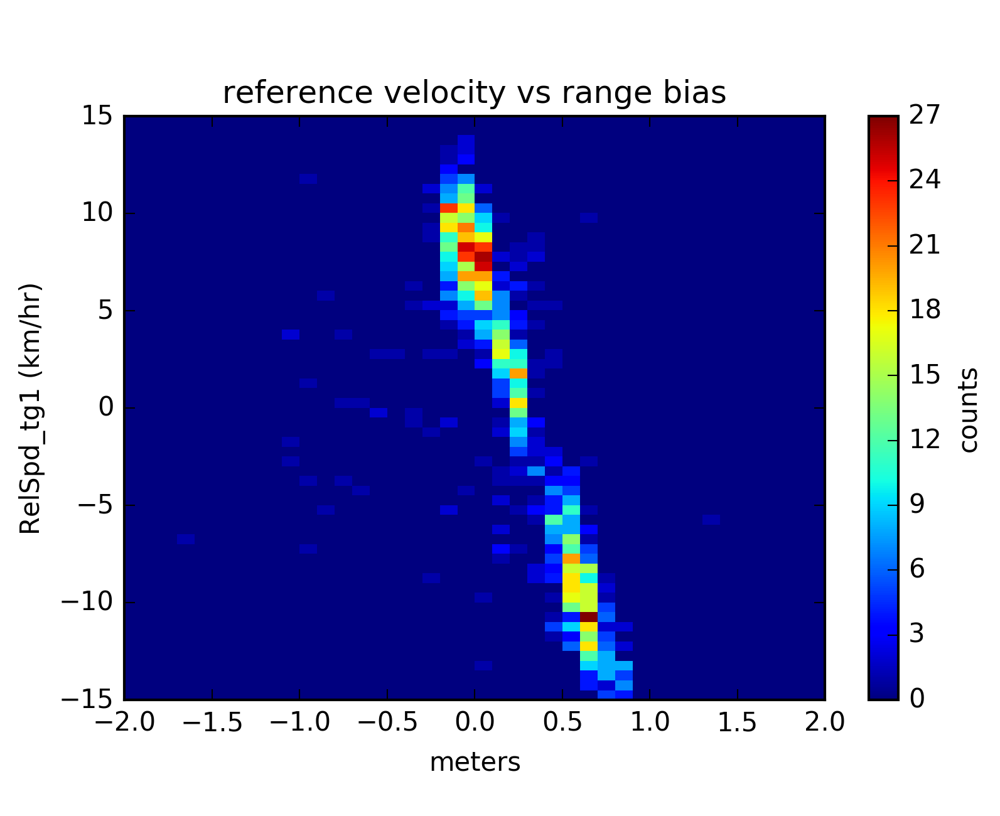

### Description
This repo contains my work in basic I/O and processing of a sample of radar data. The first goal was to write a reader capable of handling the provided CSV file as well as any other file of similar nature but representing a different scenario. The second goal was to find the radar object in the sample data which most closely matched the reference and characterize its positional and velocity errors.

The original sample data contained range, velocity, and angular GPS measurements for 2000+ time steps.


### Usage
At a terminal, navigate to the directory that contains `proc_sample.py` and type

```bash
python proc_sample.py file [-h] [-v]
 ```
 
The `file` parameter should be the file name including path of the CSV file. Arguments in brackets are optional.
 
### Dependencies
The only dependency of `proc_sample` is [NumPy](http://www.numpy.org/).
 
### Results
It turns out that the longest tracked radar object `aObject[32]` best matches to the reference. Here's the output of running `proc_sample` on the sample file provided in verbose mode:

```bash
> python proc_sample.py Scenario_crossing_left_to_right_50mph.csv -v
> Number of headers: 287
> Number of radar objects: 40
> Number of time steps: 2021
> Longest tracked radar object: aObject[32]
```

#### Positional errors
The context of this discussion assumes that both the GPS used to track the reference and the radar object identification have sub-meter, even sub-centimeter location precision. For someone like myself coming from a meteorological remote sensing background this sounds more like a fantasy, but I digress.

Here is the plot of the reference trajectory versus that of `aObject[32]`. It is clear not all trajectory data of `aObject[32]` is valid, and these time steps are ignored in my analysis.
 

  
The distributions of the trajectory differences and absolute differences between `aObject[32]` and the reference are both bimodal. The figure below was created by computing these difference fields and counting occurrences in 10 cm bins.



I originally speculated the bimodality was the result of beam broadening offsetting the position, e.g., smaller resolution volume closer to host vehicle (peak around 0 cm), larger resolution volume further from host vehicle (peak around 60 cm). However, upon further inspection, it appears the bimodality is due to directional miscalibration, where the position of objects approaching the host vehicle are systematically overestimated, on average by approx. 60 cm. This can be seen in the two-dimensional density plot between range differences and reference velocity. Range data is binned every 10 cm and velocity data is binned every 0.5 kph. The two distributions are clearly separated in this plot, one distribution for objects moving towards the host vehicle and one distribution for objects moving away from the host vehicle.



#### Velocity errors

