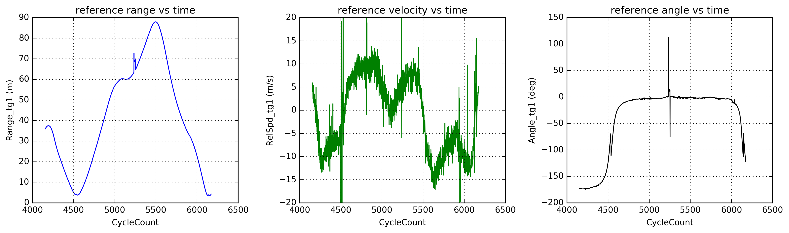

### Description
This repo contains my work in basic I/O and processing of a sample of radar data. The first goal was to write a reader capable of handling the provided CSV file as well as any other file of similar nature but representing a different scenario. The second goal was to find the radar object in the sample data which most closely matched the reference and characterize its positional and velocity errors.

The original sample data contained range, velocity, and angular GPS measurements for 2000+ time steps.



### Usage
At a terminal, navigate to the directory that contains `proc_sample.py` and type

```bash
python proc_sample.py file [-h] [-v]
 ```
 
The `file` parameter should be the file name including path of the CSV file. Arguments in brackets are optional.
 
### Dependencies
The only dependency of `proc_sample` is [NumPy](http://www.numpy.org/).
 
### Results
It turns out that the longest tracked radar object `aObject[32]` best matches to the reference. Here's the output of running `proc_sample` on the sample file provided in verbose mode:

```bash
> python proc_sample.py Scenario_crossing_left_to_right_50mph.csv -v
> Number of headers: 287
> Number of radar objects: 40
> Number of time steps: 2021
> Longest tracked radar object: aObject[32]
```


